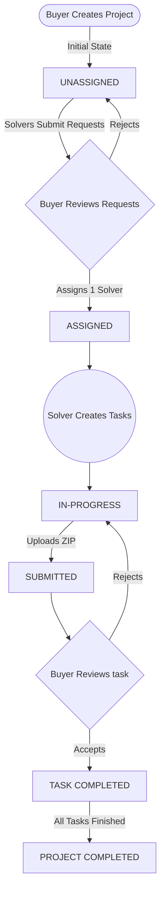

# 🌟 Judy Project Workflow System

  

This project simulates a real-world client workflow for a Marketplace Projects Division. 

It is a complete, role-based platform where **Buyers** can post projects, **Problem Solvers** can bid on and execute them through sub-tasks, and **Admins** oversee the entire ecosystem—all tied together with strict state transitions, raw ZIP file delivery, and smooth UI animations.

---

## 🧭 Navigation

This repository is built as a monorepo containing two entirely decoupled applications. Dive into the dedicated documentation for each side of the stack:

> ### 🎨 [Frontend Documentation (Next.js)](./frontend/README.md)
> Contains details on the animated role-based dashboards, UI/UX interaction flows, Framer Motion architecture, and frontend setup.

> ### ⚙️ [Backend Documentation (Express + MongoDB)](./backend/README.md)
> Contains details on the core REST API, JWT authentication, data modeling, role guards, file upload (`multer`) logic, and backend setup.

---

## 🛠️ Overall Tech Stack

| Domain | Technology | Description |
|---|---|---|
| **Frontend** | Next.js 16 (App Router), React 19 | Full-stack React framework providing routing and UI structure. |
| **Styling** | Tailwind CSS v4 | Utility-first CSS framework for rapid UI styling. |
| **Animations** | Framer Motion (Motion/React) | Smooth state-change animations and micro-interactions. |
| **Backend** | Node.js + Express 5 | Robust, scalable RESTful API foundation. |
| **Runtime** | Bun | Blazing fast JavaScript/TypeScript runtime used for both FE/BE. |
| **Database** | MongoDB + Mongoose | NoSQL database for flexible data modeling and relations. |
| **Authentication** | JWT & bcryptjs | Stateless authorization and password hashing. |
| **File Handling** | Multer | Securing task deliveries (restricted to `.zip` files). |

---

## 🧠 System Understanding & Flow Decomposition

This project models complex access control and strict data state machines. Below is the conceptual breakdown of the system.

### 🎭 1. Role Hierarchy & Capabilities

1. **🛡️ Admin**
   * **Power:** Highest level oversight.
   * **Capabilities:** Views all platform users and all marketplace projects. Can manually promote/assign the *Buyer* role to users that have submitted an application request. Cannot execute or create projects.
2. **🛒 Buyer**
   * **Power:** Project Creator & Reviewer.
   * **Capabilities:** Creates new projects to be published to the marketplace. Reviews incoming bids (*requests*) from Problem Solvers. Assigns exactly one Solver to a project (locking it). Reviews and accepts final task submissions.
3. **🔧 Problem Solver**
   * **Power:** Executor.
   * **Capabilities:** Browses the open marketplace of `Unassigned` projects. Bids on projects. Once assigned to a project, they break the project down into manageable *Tasks*, set timelines, and upload `.zip` deliverables. Can request an upgrade to a Buyer role. 

### 🔄 2. Project Lifecycle & Transitions

The application utilizes a strict state-machine architecture to prevent users from skipping critical steps in the workflow.



#### State Transition Breakdown:
* **`Unassigned` → `Assigned`**: Triggered when a Buyer explicitly accepts a Solver's request. **Crucial side effect**: The system automatically rejects all other pending requests for that specific project to enforce the 1-to-1 Buyer/Solver relationship.
* **Task `In-Progress` → `Submitted`**: Triggered exclusively by the assigned Solver uploading a valid `.zip` file via `multer`.
* **Task `Submitted` → `Completed`**: Triggered exclusively by the Buyer explicitly approving the submitted work. No auto-approvals.

---

## 🚀 Getting Started Locally

You will need to run both servers concurrently to simulate the full environment.

1. **Start the Database**: Ensure you have a local MongoDB instance running, or an active Atlas Cluster URL.
2. **Start the Backend**:
   ```bash
   cd backend
   bun install
   # Create .env with MONGO_URI and JWT_SECRET
   bun run dev
   ```
   *Runs on `http://localhost:5000`*
3. **Start the Frontend**:
   ```bash
   cd frontend
   bun install
   # Create .env.local with NEXT_PUBLIC_API_URL=http://localhost:5000
   bun run dev
   ```
   *Runs on `http://localhost:3000`*

Explore the application starting at **`http://localhost:3000`** with the brand new Landing Page CTA 🎉!
